# Reverse Engineering

## The Flag Vault


### Solution

- An ELF binary was given, which asks for a password.

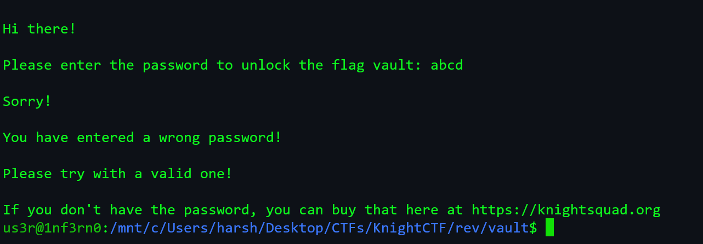
- Running `strings` on the binary gives us the password.

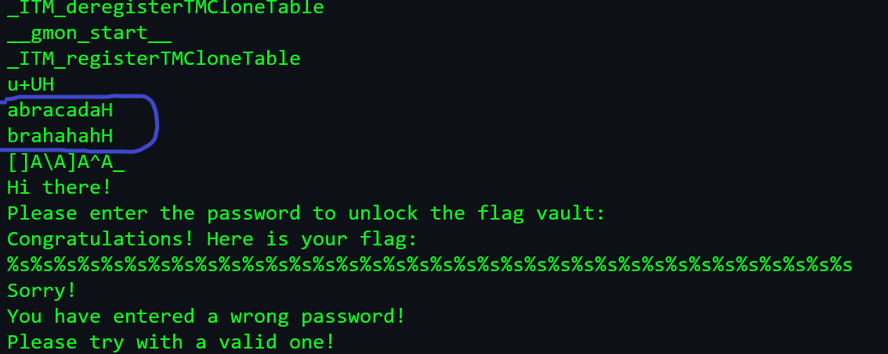

- The password is _abracadabrahahaha_. Note: Ignore "H" as the string is more than 8 characters. To avoid this confusion we can also use `ghidra`.

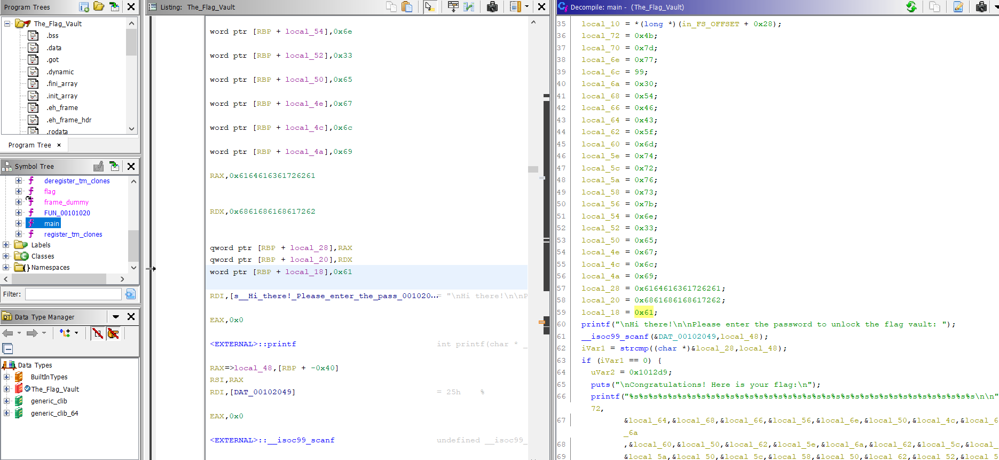

- We can even see the flag hardcoded as hex.

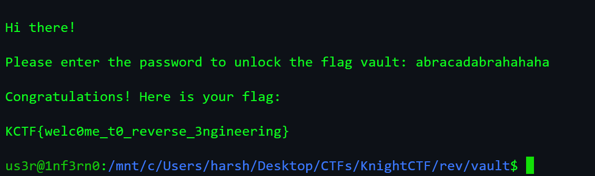

> Flag: KCTF{welc0me_t0_reverse_3ngineering}

## The Encoder

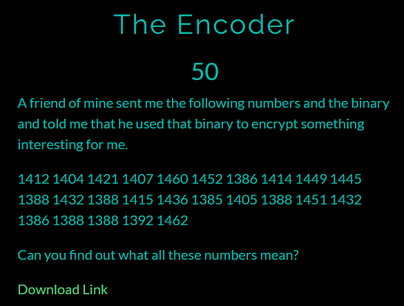

### Solution


- We fire up `ghidra` to know more about encryption.

- Alternative solution to this can be using fuzzing to generate encoded string.

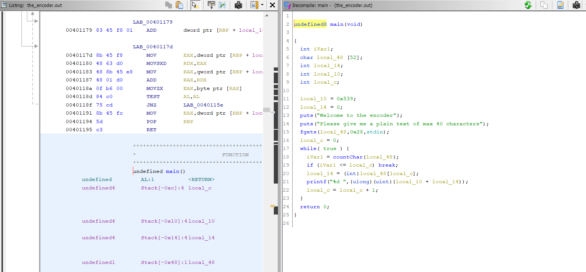

- I used a python script to solve this.

```python
import string

a = "1412 1404 1421 1407 1460 1452 1386 1414 1449 1445 1388 1432 1388 1415 1436 1385 1405 1388 1451 1432 1386 1388 1388 1392 1462"
a = a.split()

char = ""
for c in (chr(i) for i in range(32, 127)):
    char += c

# print(char)
fl = ""
count = 0
for i in a:
    count = int(i)-1385
    fl += char[count+16]
print(fl)
```

> Flag: KCTF{s1Mpl3_3Nc0D3r_1337}

## Baby shark


### Solution

- A JAR file was given, I used `JD-GUI` to decompile the file.

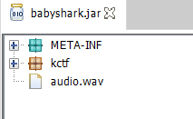

- It had a flag class but it was a fake flag.

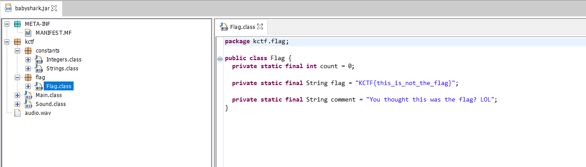

- The `Strings.class` contained the base64 encoded flag (`_0xflag` variable). 

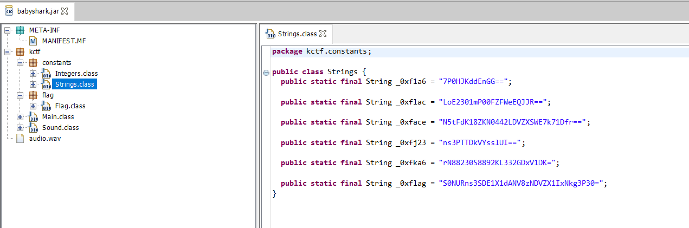

- Decoding it gives us the flag.

> Flag: KCTF{7H15_W@5_345Y_R16H7?}

## Flag Checker


### Solution

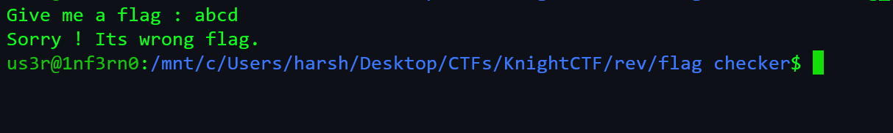

- We open the binary in `ghidra` and check the `main()` function.

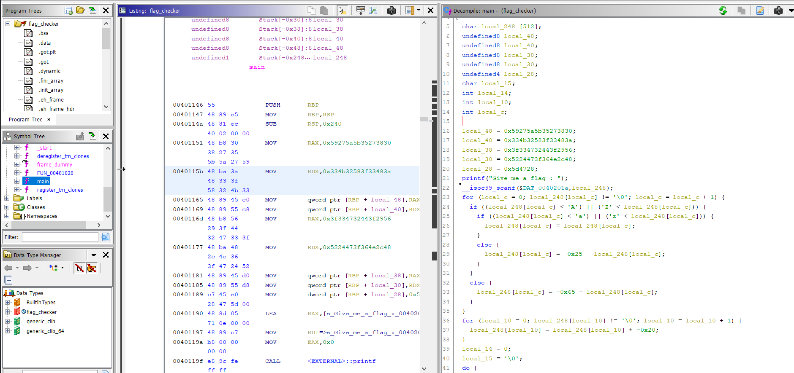

- Our encoded flag is present in `local_48`, `local_40`, `local_38`, `local_30` and `local_28`.

- I used input fuzzing to solve this challenge. Open up `gdb` and set a breakpoint at `main` function.

- The disassembly of main function:

```
Dump of assembler code for function main:
   0x0000000000401146 <+0>:     push   rbp
   0x0000000000401147 <+1>:     mov    rbp,rsp
   0x000000000040114a <+4>:     sub    rsp,0x240
   0x0000000000401151 <+11>:    movabs rax,0x59275a5b35273830
   0x000000000040115b <+21>:    movabs rdx,0x334b32583f33483a
   0x0000000000401165 <+31>:    mov    QWORD PTR [rbp-0x40],rax
   0x0000000000401169 <+35>:    mov    QWORD PTR [rbp-0x38],rdx
   0x000000000040116d <+39>:    movabs rax,0x3f334732443f2956
   0x0000000000401177 <+49>:    movabs rdx,0x5224473f364e2c48
   0x0000000000401181 <+59>:    mov    QWORD PTR [rbp-0x30],rax
   0x0000000000401185 <+63>:    mov    QWORD PTR [rbp-0x28],rdx
   0x0000000000401189 <+67>:    mov    DWORD PTR [rbp-0x20],0x5d4728
   0x0000000000401190 <+74>:    lea    rax,[rip+0xe71]        # 0x402008
   0x0000000000401197 <+81>:    mov    rdi,rax
   0x000000000040119a <+84>:    mov    eax,0x0
   0x000000000040119f <+89>:    call   0x401040 <printf@plt>
   0x00000000004011a4 <+94>:    lea    rax,[rbp-0x240]
   0x00000000004011ab <+101>:   mov    rsi,rax
   0x00000000004011ae <+104>:   lea    rax,[rip+0xe65]        # 0x40201a
   0x00000000004011b5 <+111>:   mov    rdi,rax
   0x00000000004011b8 <+114>:   mov    eax,0x0
   0x00000000004011bd <+119>:   call   0x401050 <__isoc99_scanf@plt>
   0x00000000004011c2 <+124>:   mov    DWORD PTR [rbp-0x4],0x0
   0x00000000004011c9 <+131>:   jmp    0x40127b <main+309>
   0x00000000004011ce <+136>:   mov    eax,DWORD PTR [rbp-0x4]
   0x00000000004011d1 <+139>:   cdqe
   0x00000000004011d3 <+141>:   movzx  eax,BYTE PTR [rbp+rax*1-0x240]
   0x00000000004011db <+149>:   cmp    al,0x40
   0x00000000004011dd <+151>:   jle    0x401216 <main+208>
   0x00000000004011df <+153>:   mov    eax,DWORD PTR [rbp-0x4]
   0x00000000004011e2 <+156>:   cdqe
   0x00000000004011e4 <+158>:   movzx  eax,BYTE PTR [rbp+rax*1-0x240]
   0x00000000004011ec <+166>:   cmp    al,0x5a
   0x00000000004011ee <+168>:   jg     0x401216 <main+208>
   0x00000000004011f0 <+170>:   mov    eax,DWORD PTR [rbp-0x4]
   0x00000000004011f3 <+173>:   cdqe
   0x00000000004011f5 <+175>:   movzx  eax,BYTE PTR [rbp+rax*1-0x240]
   0x00000000004011fd <+183>:   mov    edx,eax
   0x00000000004011ff <+185>:   mov    eax,0xffffff9b
   0x0000000000401204 <+190>:   sub    eax,edx
   0x0000000000401206 <+192>:   mov    edx,eax
   0x0000000000401208 <+194>:   mov    eax,DWORD PTR [rbp-0x4]
   0x000000000040120b <+197>:   cdqe
   0x000000000040120d <+199>:   mov    BYTE PTR [rbp+rax*1-0x240],dl
   0x0000000000401214 <+206>:   jmp    0x401277 <main+305>
   0x0000000000401216 <+208>:   mov    eax,DWORD PTR [rbp-0x4]
   0x0000000000401219 <+211>:   cdqe
   0x000000000040121b <+213>:   movzx  eax,BYTE PTR [rbp+rax*1-0x240]
   0x0000000000401223 <+221>:   cmp    al,0x60
   0x0000000000401225 <+223>:   jle    0x40125e <main+280>
   0x0000000000401227 <+225>:   mov    eax,DWORD PTR [rbp-0x4]
   0x000000000040122a <+228>:   cdqe
   0x000000000040122c <+230>:   movzx  eax,BYTE PTR [rbp+rax*1-0x240]
   0x0000000000401234 <+238>:   cmp    al,0x7a
   0x0000000000401236 <+240>:   jg     0x40125e <main+280>
   0x0000000000401238 <+242>:   mov    eax,DWORD PTR [rbp-0x4]
   0x000000000040123b <+245>:   cdqe
   0x000000000040123d <+247>:   movzx  eax,BYTE PTR [rbp+rax*1-0x240]
   0x0000000000401245 <+255>:   mov    edx,eax
   0x0000000000401247 <+257>:   mov    eax,0xffffffdb
   0x000000000040124c <+262>:   sub    eax,edx
   0x000000000040124e <+264>:   mov    edx,eax
   0x0000000000401250 <+266>:   mov    eax,DWORD PTR [rbp-0x4]
   0x0000000000401253 <+269>:   cdqe
   0x0000000000401255 <+271>:   mov    BYTE PTR [rbp+rax*1-0x240],dl
   0x000000000040125c <+278>:   jmp    0x401277 <main+305>
   0x000000000040125e <+280>:   mov    eax,DWORD PTR [rbp-0x4]
   0x0000000000401261 <+283>:   cdqe
   0x0000000000401263 <+285>:   movzx  edx,BYTE PTR [rbp+rax*1-0x240]
   0x000000000040126b <+293>:   mov    eax,DWORD PTR [rbp-0x4]
   0x000000000040126e <+296>:   cdqe
   0x0000000000401270 <+298>:   mov    BYTE PTR [rbp+rax*1-0x240],dl
   0x0000000000401277 <+305>:   add    DWORD PTR [rbp-0x4],0x1
   0x000000000040127b <+309>:   mov    eax,DWORD PTR [rbp-0x4]
   0x000000000040127e <+312>:   cdqe
   0x0000000000401280 <+314>:   movzx  eax,BYTE PTR [rbp+rax*1-0x240]
   0x0000000000401288 <+322>:   test   al,al
   0x000000000040128a <+324>:   jne    0x4011ce <main+136>
   0x0000000000401290 <+330>:   mov    DWORD PTR [rbp-0x8],0x0
   0x0000000000401297 <+337>:   jmp    0x4012bb <main+373>
   0x0000000000401299 <+339>:   mov    eax,DWORD PTR [rbp-0x8]
   0x000000000040129c <+342>:   cdqe
   0x000000000040129e <+344>:   movzx  eax,BYTE PTR [rbp+rax*1-0x240]
   0x00000000004012a6 <+352>:   sub    eax,0x20
   0x00000000004012a9 <+355>:   mov    edx,eax
   0x00000000004012ab <+357>:   mov    eax,DWORD PTR [rbp-0x8]
   0x00000000004012ae <+360>:   cdqe
   0x00000000004012b0 <+362>:   mov    BYTE PTR [rbp+rax*1-0x240],dl
   0x00000000004012b7 <+369>:   add    DWORD PTR [rbp-0x8],0x1
   0x00000000004012bb <+373>:   mov    eax,DWORD PTR [rbp-0x8]
   0x00000000004012be <+376>:   cdqe
   0x00000000004012c0 <+378>:   movzx  eax,BYTE PTR [rbp+rax*1-0x240]
   0x00000000004012c8 <+386>:   test   al,al
   0x00000000004012ca <+388>:   jne    0x401299 <main+339>
   0x00000000004012cc <+390>:   mov    DWORD PTR [rbp-0xc],0x0
   0x00000000004012d3 <+397>:   mov    BYTE PTR [rbp-0xd],0x0
   0x00000000004012d7 <+401>:   jmp    0x401302 <main+444>
   0x00000000004012d9 <+403>:   mov    eax,DWORD PTR [rbp-0xc]
   0x00000000004012dc <+406>:   cdqe
   0x00000000004012de <+408>:   movzx  edx,BYTE PTR [rbp+rax*1-0x40]
   0x00000000004012e3 <+413>:   mov    eax,DWORD PTR [rbp-0xc]
   0x00000000004012e6 <+416>:   cdqe
   0x00000000004012e8 <+418>:   movzx  eax,BYTE PTR [rbp+rax*1-0x240]
   0x00000000004012f0 <+426>:   cmp    dl,al
   0x00000000004012f2 <+428>:   je     0x4012fa <main+436>
   0x00000000004012f4 <+430>:   mov    BYTE PTR [rbp-0xd],0x0
   0x00000000004012f8 <+434>:   jmp    0x401310 <main+458>
   0x00000000004012fa <+436>:   mov    BYTE PTR [rbp-0xd],0x1
   0x00000000004012fe <+440>:   add    DWORD PTR [rbp-0xc],0x1
   0x0000000000401302 <+444>:   mov    eax,DWORD PTR [rbp-0xc]
   0x0000000000401305 <+447>:   cdqe
   0x0000000000401307 <+449>:   movzx  eax,BYTE PTR [rbp+rax*1-0x40]
   0x000000000040130c <+454>:   test   al,al
   0x000000000040130e <+456>:   jne    0x4012d9 <main+403>
   0x0000000000401310 <+458>:   cmp    BYTE PTR [rbp-0xd],0x0
   0x0000000000401314 <+462>:   je     0x401327 <main+481>
   0x0000000000401316 <+464>:   lea    rax,[rip+0xd03]        # 0x402020
   0x000000000040131d <+471>:   mov    rdi,rax
   0x0000000000401320 <+474>:   call   0x401030 <puts@plt>
   0x0000000000401325 <+479>:   jmp    0x401336 <main+496>
   0x0000000000401327 <+481>:   lea    rax,[rip+0xd13]        # 0x402041
   0x000000000040132e <+488>:   mov    rdi,rax
   0x0000000000401331 <+491>:   call   0x401030 <puts@plt>
   0x0000000000401336 <+496>:   mov    eax,0x0
   0x000000000040133b <+501>:   leave
   0x000000000040133c <+502>:   ret
End of assembler dump.
```

- Set a breakpoint at CMP instruction at `0x0000000000401310`.

- Now, run the program and supply some characters, for example _abcd_.

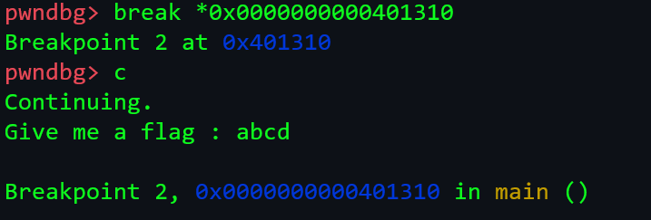

- If we analyse the stack, we can see our supplied string which is encoded.

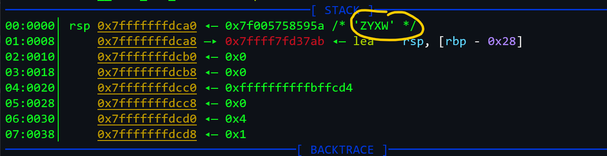

- Similarly, we can fuzz the input and observe the encoded values on stack.

- After fuzzing, I created a python script to decode the values that we found from `ghidra`.

```python
import string

a = "Y'Z[5'80"
a = a[::-1]     # Due to little endian format, we need to reverse it
b = "3K2X?3H:"
b = b[::-1]
c = "?3G2D?)V"
c = c[::-1]
d = "R$G?6N,H"
d = d[::-1]
e = "]G("
e = e[::-1]

cap_enc = """:9876543210/.-,+*)(\'&%$#"!"""
lwr_enc = "ZYXWVUTSRQPONMLKJIHGFEDCBA"

cap = string.ascii_uppercase
lwr = string.ascii_lowercase

ar = [a,b,c,d,e]

temp = ""
for i in ar:
    for j in i:
        if j == '?':
            temp += '_'
            continue
        if j == '[':
            temp += '{'
            continue
        if j == ']':
            temp += '}'
            continue
        if j in lwr_enc:
            temp += lwr[lwr_enc.index(j)]
        else:
            temp += cap[cap_enc.index(j)]
print(temp)
```

> Flag: KCTF{aTbAsH_cIpHeR_wItH_sOmE_tWiSt}

## Knight Vault

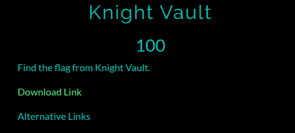

### Solution

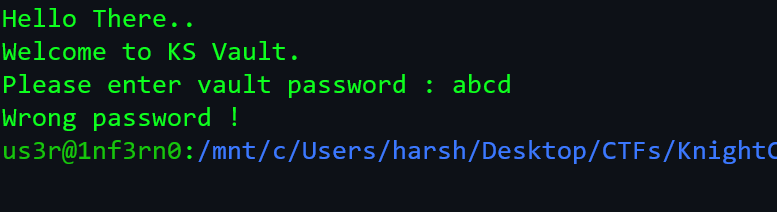

- We open the file in `ghidra`.

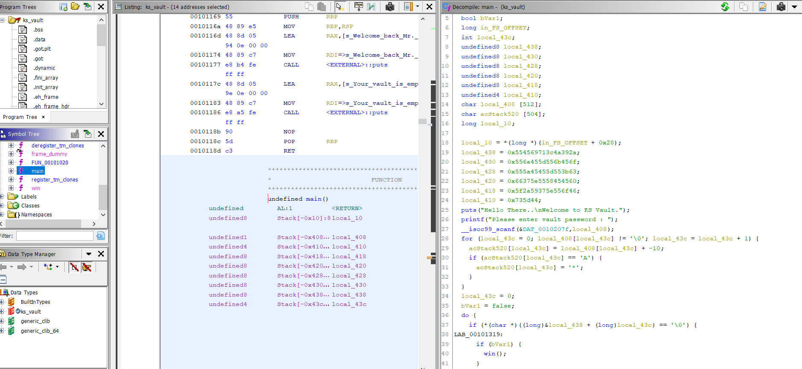

- We can see our encoded flag in `local_438`, `local_430`, `local_428`, `local_420`, `local_418` and `local_410`. After converting them into string we get: 
***9J<qiEUoEkU]EjUc;U]EEZU`EEXU^7fFoU^7Y*_D]s**

>**Note**: Since, it follows little endian format, reverse each variable before merging them into one string.

- Another way to find the encoded flag is using `gdb`. Similar to previous challenge, we can set a breakpoint at a CMP instruction and check the stack.

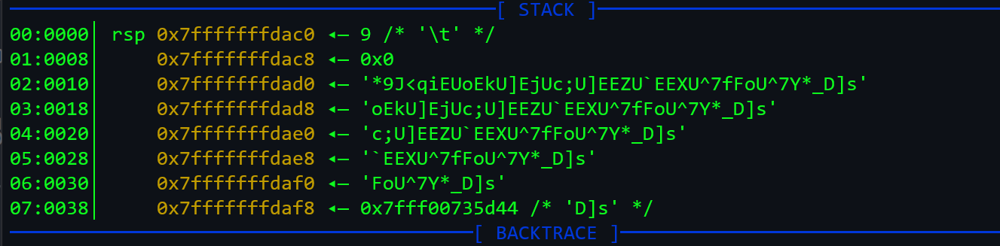

- The code is pretty simple; 10 is subtracted from each characters ASCII value and if the character is "A" then it is simply replaced by "*".

- So, I wrote a simple python script to solve this.


```python
enc = "*9J<qiEUoEkU]EjUc;U]EEZU`EEXU^7fFoU^7Y*_D]s"

flag = ''
for i in ab:
    if i == '*':
        flag += 'K'     # A + 10 = K
        continue
    flag += chr(ord(i)+10)
print(flag)
```

> Flag: KCTF{sO_yOu_gOt_mE_gOOd_jOOb_hApPy_hAcKiNg}

## Droid Flag


### Solution

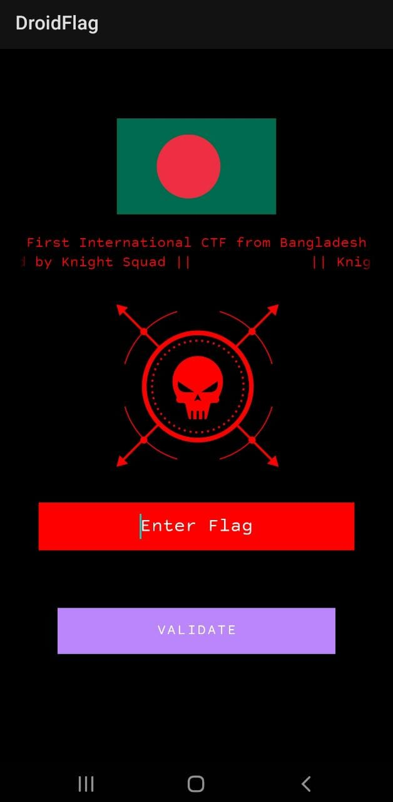

- We can use `apktool` but I used [this](http://www.javadecompilers.com/) website quite useful.

- After decompiling it, under __sources > org > knightsquad > droidflag__, I decompiled the `MainActivity.java` and found this statement:

```java
StringHandler stringHandler = new StringHandler();
                    if ((stringHandler.getS1(MainActivity.this) + "{" + stringHandler.getS3(MainActivity.this) + "_" + stringHandler.getS2(MainActivity.this) + "_" + stringHandler.getS4(MainActivity.this) + "}").equals(obj))
```

- Hence, I checked the __resources > res > values > strings.xml__ file.

```xml
<string name="s1">KCTF{}</string>
    <string name="s10">You have entered the right flag. Good Job.</string>
    <string name="s11">Warning</string>
    <string name="s12">You have entered a wrong flag. Pleae try again.</string>
    <string name="s2">KCTF2022{}</string>
    <string name="s3">KnightCTF{}</string>
    <string name="s4">KnightCTF200{}</string>
    <string name="s5">KCTF</string>
    <string name="s6">3LpM1s</string>
    <string name="s7">D10RdNa</string>
    <string name="s8">3Sr3V3r</string>
    <string name="s9">Congratulations</string>
```

- Then I checked __sources > org > knightsquad > droidflag > StringHandler.java__ file.

```java
public class StringHandler extends AppCompatActivity {
    public String getS1(Context context) {
        return context.getResources().getString(C0745R.string.f112s5);
    }

    public String getS2(Context context) {
        return new StringBuilder(context.getResources().getString(C0745R.string.f113s6)).reverse().toString();
    }

    public String getS3(Context context) {
        return new StringBuilder(context.getResources().getString(C0745R.string.f114s7)).reverse().toString();
    }

    public String getS4(Context context) {
        return new StringBuilder(context.getResources().getString(C0745R.string.f115s8)).reverse().toString();
    }
}
```

- As we can see, the strings are reversed to form the flag.

> Flag: KCTF{aNdR01D_s1MpL3_r3V3rS3}

##  Knight Switch Bank


### Solution

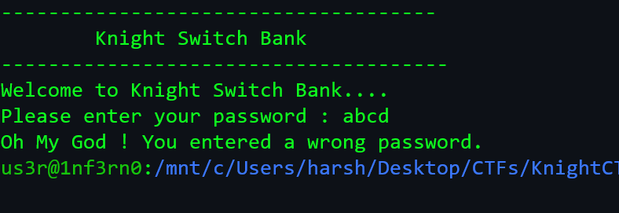

- We open the binary in `ghidra` and analyse the `main` function.

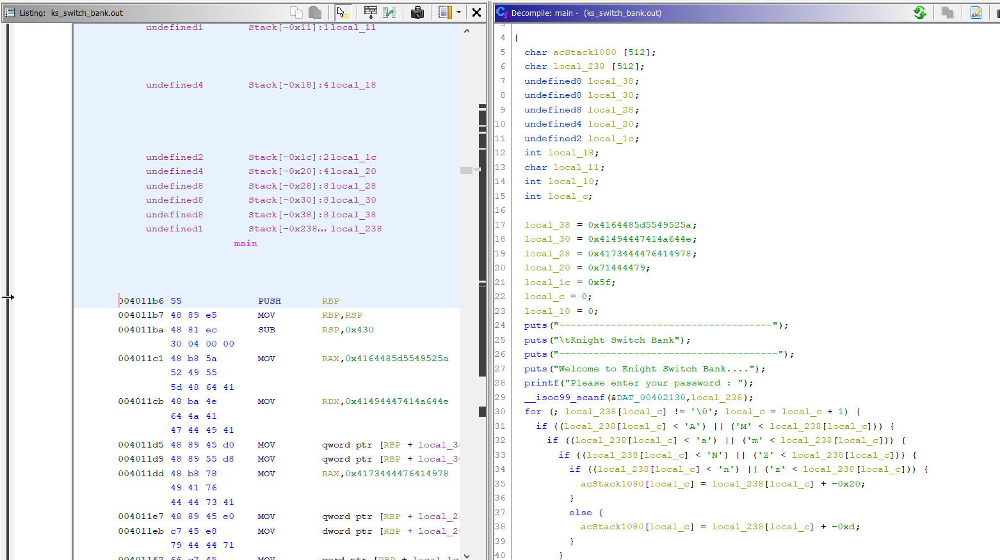

- Similar to previous challenge, this has the encoded flag hardcoded in `local_38`, `local_30`, `local_28`, `local_20` and `local_1c`.

- We load the binary in `gdb` and set breakpoints at `main` and CMP instruction (_0x0000000000401437_) and then analyse the stack.

```
   0x00000000004011b6 <+0>:     push   rbp
   0x00000000004011b7 <+1>:     mov    rbp,rsp
   0x00000000004011ba <+4>:     sub    rsp,0x430
   0x00000000004011c1 <+11>:    movabs rax,0x4164485d5549525a
   0x00000000004011cb <+21>:    movabs rdx,0x41494447414a644e
   0x00000000004011d5 <+31>:    mov    QWORD PTR [rbp-0x30],rax
   0x00000000004011d9 <+35>:    mov    QWORD PTR [rbp-0x28],rdx
   0x00000000004011dd <+39>:    movabs rax,0x4173444476414978
   0x00000000004011e7 <+49>:    mov    QWORD PTR [rbp-0x20],rax
   0x00000000004011eb <+53>:    mov    DWORD PTR [rbp-0x18],0x71444479
   0x00000000004011f2 <+60>:    mov    WORD PTR [rbp-0x14],0x5f
   0x00000000004011f8 <+66>:    mov    DWORD PTR [rbp-0x4],0x0
   0x00000000004011ff <+73>:    mov    DWORD PTR [rbp-0x8],0x0
   0x0000000000401206 <+80>:    lea    rax,[rip+0xdfb]        # 0x402008
   0x000000000040120d <+87>:    mov    rdi,rax
   0x0000000000401210 <+90>:    call   0x401030 <puts@plt>
   0x0000000000401215 <+95>:    lea    rax,[rip+0xe12]        # 0x40202e
   0x000000000040121c <+102>:   mov    rdi,rax
   0x000000000040121f <+105>:   call   0x401030 <puts@plt>
   0x0000000000401224 <+110>:   lea    rax,[rip+0xe1d]        # 0x402048
   0x000000000040122b <+117>:   mov    rdi,rax
   0x000000000040122e <+120>:   call   0x401030 <puts@plt>
   0x0000000000401233 <+125>:   lea    rax,[rip+0xeb6]        # 0x4020f0
   0x000000000040123a <+132>:   mov    rdi,rax
   0x000000000040123d <+135>:   call   0x401030 <puts@plt>
   0x0000000000401242 <+140>:   lea    rax,[rip+0xec9]        # 0x402112
   0x0000000000401249 <+147>:   mov    rdi,rax
   0x000000000040124c <+150>:   mov    eax,0x0
   0x0000000000401251 <+155>:   call   0x401040 <printf@plt>
   0x0000000000401256 <+160>:   lea    rax,[rbp-0x230]
   0x000000000040125d <+167>:   mov    rsi,rax
   0x0000000000401260 <+170>:   lea    rax,[rip+0xec9]        # 0x402130
   0x0000000000401267 <+177>:   mov    rdi,rax
   0x000000000040126a <+180>:   mov    eax,0x0
   0x000000000040126f <+185>:   call   0x401050 <__isoc99_scanf@plt>
   0x0000000000401274 <+190>:   jmp    0x4013a9 <main+499>
   0x0000000000401279 <+195>:   mov    eax,DWORD PTR [rbp-0x4]
   0x000000000040127c <+198>:   cdqe
   0x000000000040127e <+200>:   movzx  eax,BYTE PTR [rbp+rax*1-0x230]
   0x0000000000401286 <+208>:   cmp    al,0x40
   0x0000000000401288 <+210>:   jle    0x4012be <main+264>
   0x000000000040128a <+212>:   mov    eax,DWORD PTR [rbp-0x4]
   0x000000000040128d <+215>:   cdqe
   0x000000000040128f <+217>:   movzx  eax,BYTE PTR [rbp+rax*1-0x230]
   0x0000000000401297 <+225>:   cmp    al,0x4d
   0x0000000000401299 <+227>:   jg     0x4012be <main+264>
   0x000000000040129b <+229>:   mov    eax,DWORD PTR [rbp-0x4]
   0x000000000040129e <+232>:   cdqe
   0x00000000004012a0 <+234>:   movzx  eax,BYTE PTR [rbp+rax*1-0x230]
   0x00000000004012a8 <+242>:   add    eax,0xd
   0x00000000004012ab <+245>:   mov    edx,eax
   0x00000000004012ad <+247>:   mov    eax,DWORD PTR [rbp-0x4]
   0x00000000004012b0 <+250>:   cdqe
   0x00000000004012b2 <+252>:   mov    BYTE PTR [rbp+rax*1-0x430],dl
   0x00000000004012b9 <+259>:   jmp    0x4013a5 <main+495>
   0x00000000004012be <+264>:   mov    eax,DWORD PTR [rbp-0x4]
   0x00000000004012c1 <+267>:   cdqe
   0x00000000004012c3 <+269>:   movzx  eax,BYTE PTR [rbp+rax*1-0x230]
   0x00000000004012cb <+277>:   cmp    al,0x60
   0x00000000004012cd <+279>:   jle    0x401303 <main+333>
   0x00000000004012cf <+281>:   mov    eax,DWORD PTR [rbp-0x4]
   0x00000000004012d2 <+284>:   cdqe
   0x00000000004012d4 <+286>:   movzx  eax,BYTE PTR [rbp+rax*1-0x230]
   0x00000000004012dc <+294>:   cmp    al,0x6d
   0x00000000004012de <+296>:   jg     0x401303 <main+333>
   0x00000000004012e0 <+298>:   mov    eax,DWORD PTR [rbp-0x4]
   0x00000000004012e3 <+301>:   cdqe
   0x00000000004012e5 <+303>:   movzx  eax,BYTE PTR [rbp+rax*1-0x230]
   0x00000000004012ed <+311>:   add    eax,0xd
   0x00000000004012f0 <+314>:   mov    edx,eax
   0x00000000004012f2 <+316>:   mov    eax,DWORD PTR [rbp-0x4]
   0x00000000004012f5 <+319>:   cdqe
   0x00000000004012f7 <+321>:   mov    BYTE PTR [rbp+rax*1-0x430],dl
   0x00000000004012fe <+328>:   jmp    0x4013a5 <main+495>
   0x0000000000401303 <+333>:   mov    eax,DWORD PTR [rbp-0x4]
   0x0000000000401306 <+336>:   cdqe
   0x0000000000401308 <+338>:   movzx  eax,BYTE PTR [rbp+rax*1-0x230]
   0x0000000000401310 <+346>:   cmp    al,0x4d
   0x0000000000401312 <+348>:   jle    0x401345 <main+399>
   0x0000000000401314 <+350>:   mov    eax,DWORD PTR [rbp-0x4]
   0x0000000000401317 <+353>:   cdqe
   0x0000000000401319 <+355>:   movzx  eax,BYTE PTR [rbp+rax*1-0x230]
   0x0000000000401321 <+363>:   cmp    al,0x5a
   0x0000000000401323 <+365>:   jg     0x401345 <main+399>
   0x0000000000401325 <+367>:   mov    eax,DWORD PTR [rbp-0x4]
   0x0000000000401328 <+370>:   cdqe
   0x000000000040132a <+372>:   movzx  eax,BYTE PTR [rbp+rax*1-0x230]
   0x0000000000401332 <+380>:   sub    eax,0xd
   0x0000000000401335 <+383>:   mov    edx,eax
   0x0000000000401337 <+385>:   mov    eax,DWORD PTR [rbp-0x4]
   0x000000000040133a <+388>:   cdqe
   0x000000000040133c <+390>:   mov    BYTE PTR [rbp+rax*1-0x430],dl
   0x0000000000401343 <+397>:   jmp    0x4013a5 <main+495>
   0x0000000000401345 <+399>:   mov    eax,DWORD PTR [rbp-0x4]
   0x0000000000401348 <+402>:   cdqe
   0x000000000040134a <+404>:   movzx  eax,BYTE PTR [rbp+rax*1-0x230]
   0x0000000000401352 <+412>:   cmp    al,0x6d
   0x0000000000401354 <+414>:   jle    0x401387 <main+465>
   0x0000000000401356 <+416>:   mov    eax,DWORD PTR [rbp-0x4]
   0x0000000000401359 <+419>:   cdqe
   0x000000000040135b <+421>:   movzx  eax,BYTE PTR [rbp+rax*1-0x230]
   0x0000000000401363 <+429>:   cmp    al,0x7a
   0x0000000000401365 <+431>:   jg     0x401387 <main+465>
   0x0000000000401367 <+433>:   mov    eax,DWORD PTR [rbp-0x4]
   0x000000000040136a <+436>:   cdqe
   0x000000000040136c <+438>:   movzx  eax,BYTE PTR [rbp+rax*1-0x230]
   0x0000000000401374 <+446>:   sub    eax,0xd
   0x0000000000401377 <+449>:   mov    edx,eax
   0x0000000000401379 <+451>:   mov    eax,DWORD PTR [rbp-0x4]
   0x000000000040137c <+454>:   cdqe
   0x000000000040137e <+456>:   mov    BYTE PTR [rbp+rax*1-0x430],dl
   0x0000000000401385 <+463>:   jmp    0x4013a5 <main+495>
   0x0000000000401387 <+465>:   mov    eax,DWORD PTR [rbp-0x4]
   0x000000000040138a <+468>:   cdqe
   0x000000000040138c <+470>:   movzx  eax,BYTE PTR [rbp+rax*1-0x230]
   0x0000000000401394 <+478>:   sub    eax,0x20
   0x0000000000401397 <+481>:   mov    edx,eax
   0x0000000000401399 <+483>:   mov    eax,DWORD PTR [rbp-0x4]
   0x000000000040139c <+486>:   cdqe
   0x000000000040139e <+488>:   mov    BYTE PTR [rbp+rax*1-0x430],dl
   0x00000000004013a5 <+495>:   add    DWORD PTR [rbp-0x4],0x1
   0x00000000004013a9 <+499>:   mov    eax,DWORD PTR [rbp-0x4]
   0x00000000004013ac <+502>:   cdqe
   0x00000000004013ae <+504>:   movzx  eax,BYTE PTR [rbp+rax*1-0x230]
   0x00000000004013b6 <+512>:   test   al,al
   0x00000000004013b8 <+514>:   jne    0x401279 <main+195>
   0x00000000004013be <+520>:   jmp    0x4013e2 <main+556>
   0x00000000004013c0 <+522>:   mov    eax,DWORD PTR [rbp-0x8]
   0x00000000004013c3 <+525>:   cdqe
   0x00000000004013c5 <+527>:   movzx  eax,BYTE PTR [rbp+rax*1-0x430]
   0x00000000004013cd <+535>:   add    eax,0x2
   0x00000000004013d0 <+538>:   mov    edx,eax
   0x00000000004013d2 <+540>:   mov    eax,DWORD PTR [rbp-0x8]
   0x00000000004013d5 <+543>:   cdqe
   0x00000000004013d7 <+545>:   mov    BYTE PTR [rbp+rax*1-0x430],dl
   0x00000000004013de <+552>:   add    DWORD PTR [rbp-0x8],0x1
   0x00000000004013e2 <+556>:   mov    eax,DWORD PTR [rbp-0x8]
   0x00000000004013e5 <+559>:   cdqe
   0x00000000004013e7 <+561>:   movzx  eax,BYTE PTR [rbp+rax*1-0x430]
   0x00000000004013ef <+569>:   test   al,al
   0x00000000004013f1 <+571>:   jne    0x4013c0 <main+522>
   0x00000000004013f3 <+573>:   mov    BYTE PTR [rbp-0x9],0x0
   0x00000000004013f7 <+577>:   mov    DWORD PTR [rbp-0x10],0x0
   0x00000000004013fe <+584>:   jmp    0x401429 <main+627>
   0x0000000000401400 <+586>:   mov    eax,DWORD PTR [rbp-0x10]
   0x0000000000401403 <+589>:   cdqe
   0x0000000000401405 <+591>:   movzx  edx,BYTE PTR [rbp+rax*1-0x30]
   0x000000000040140a <+596>:   mov    eax,DWORD PTR [rbp-0x10]
   0x000000000040140d <+599>:   cdqe
   0x000000000040140f <+601>:   movzx  eax,BYTE PTR [rbp+rax*1-0x430]
   0x0000000000401417 <+609>:   cmp    dl,al
   0x0000000000401419 <+611>:   je     0x401421 <main+619>
   0x000000000040141b <+613>:   mov    BYTE PTR [rbp-0x9],0x0
   0x000000000040141f <+617>:   jmp    0x401437 <main+641>
   0x0000000000401421 <+619>:   mov    BYTE PTR [rbp-0x9],0x1
   0x0000000000401425 <+623>:   add    DWORD PTR [rbp-0x10],0x1
   0x0000000000401429 <+627>:   mov    eax,DWORD PTR [rbp-0x10]
   0x000000000040142c <+630>:   cdqe
   0x000000000040142e <+632>:   movzx  eax,BYTE PTR [rbp+rax*1-0x30]
   0x0000000000401433 <+637>:   test   al,al
   0x0000000000401435 <+639>:   jne    0x401400 <main+586>
=> 0x0000000000401437 <+641>:   cmp    BYTE PTR [rbp-0x9],0x0
   0x000000000040143b <+645>:   je     0x401449 <main+659>
   0x000000000040143d <+647>:   mov    eax,0x0
   0x0000000000401442 <+652>:   call   0x401146 <winner>
   0x0000000000401447 <+657>:   jmp    0x401458 <main+674>
   0x0000000000401449 <+659>:   lea    rax,[rip+0xce8]        # 0x402138
   0x0000000000401450 <+666>:   mov    rdi,rax
   0x0000000000401453 <+669>:   call   0x401030 <puts@plt>
   0x0000000000401458 <+674>:   mov    eax,0x0
   0x000000000040145d <+679>:   leave
   0x000000000040145e <+680>:   ret
```

- We fuzz the input and see the encoded values on stack, for example, the input password is _abcd_ and its encoded value is:

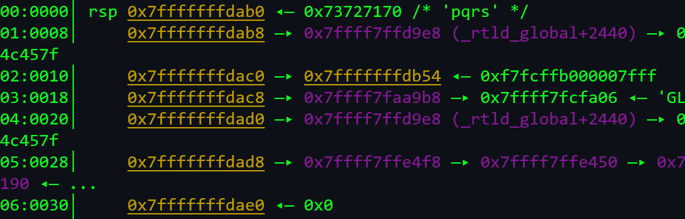

- Here, the encoded value of _abcd_ is _pqrs_.

- After fuzzing, I used a python script to decode our encoded flag.

```python
import string

upr_enc = "PQRSTUVWXYZ[\CDEFGHIJKLMNO"
lwr_enc = "pqrstuvwxyz{|cdefghijklmno"

one = "AdH]UIRZ"
one = one[::-1]     # Due to little endian format
two = "AIDGAJdN"
two = two[::-1]
three = "AsDDvAIx"
three = three[::-1]
four = "qDDy"
four = four[::-1]

ar = [one,two,three,four]

upr = string.ascii_uppercase
lwr = string.ascii_lowercase

temp = ""
for i in ar:
    for j in i:
        if j == 'A' or j == 'a':
             temp += '_'
             continue
        if j.isupper():
            temp += upr[upr_enc.index(j)]
        elif j.islower():
            temp += lwr[lwr_enc.index(j)]
print(temp)
```

- This gives us: *KCTFSo_YoU_ROT_iT_gOOd_jOOb*
We just need to add "{}".

> Flag: KCTF{So_YoU_ROT_iT_gOOd_jOOb}


# Forensics

## The Lost Flag

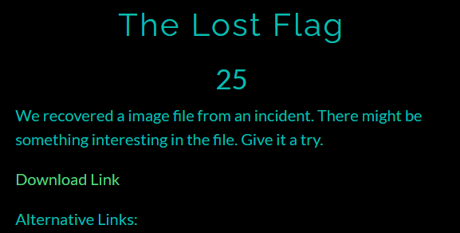

### Solution


- This image was given, `exiftool` did not yield anything special.

- So, I used an awesome online tool called [Forensically](https://29a.ch/photo-forensics/).

- Using PCA I found the flag.

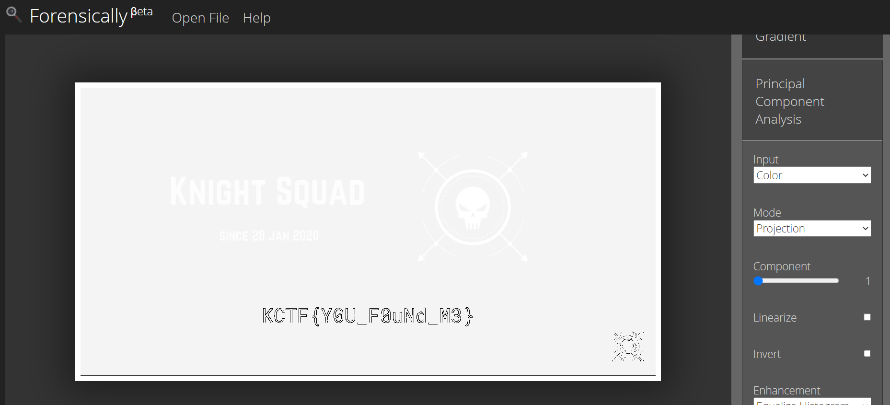

> Flag: KCTF{Y0U_F0uNd_M3}

## Compromised FTP

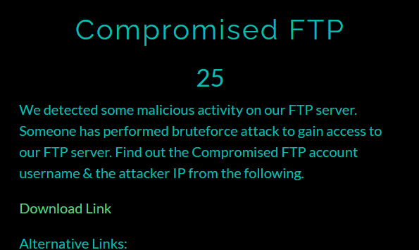

### Solution

- So, it was basically a log file. Since, an `OK` status is sent on successful login in FTP, we search for string "OK".

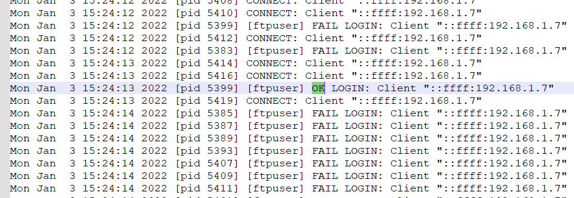

- Hence, the username is `ftpuser` and the IP of the attacker is `192.168.1.7`.

> Flag: KCTF{ftpuser_192.168.1.7}

## Unknown File

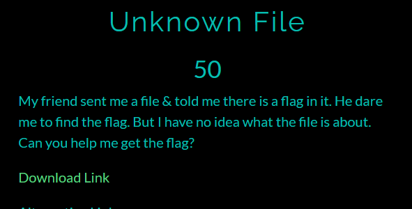

### Solution

- Running `file` on the file did not yield anything.

- Opening the file in hex editor gave some clue.

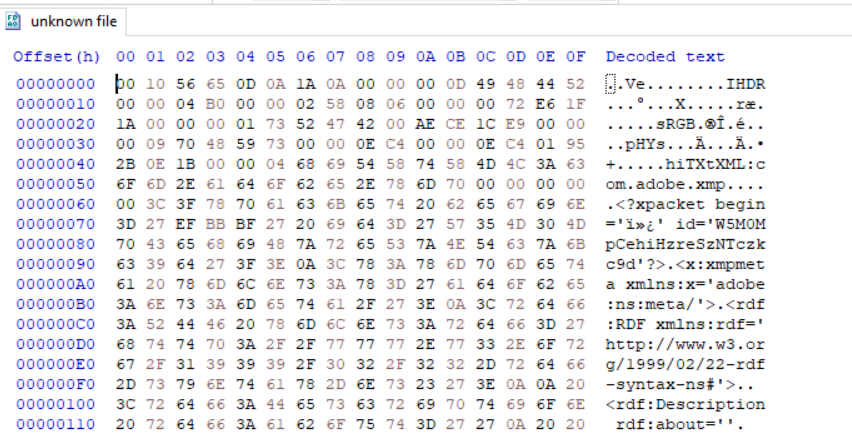

- Since, `IHDR` chunk is present, it is a PNG image. Fixing the header and saving the image as PNG gives us the flag.

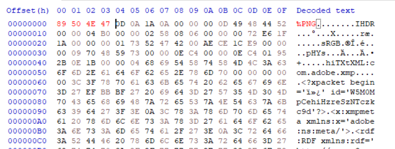

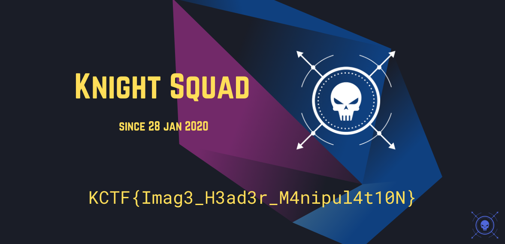

> Flag: KCTF{Imag3_H3ad3r_M4nipul4t10N}

## Let's Walk Together


### Solution


- This image was given and if we use image search on Google, we get binwalk entropy.

- Hence, I used `binwalk` on the image.

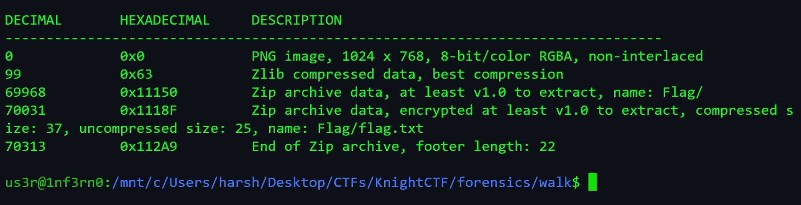

- It gave out a zip file which contained _flag.txt_ but, the it is password protected.

- I used `zip2john` to extract the password hash.

`
$pkzip$1*2*2*0*25*19*7dffa5fe*3f*47*0*25*5e93*ab2861d9320438eae7ce0cfc5c136c9ff1c7c289172d5a9eade62b6da3ba7195354bb15c02*$/pkzip$
`

- Using `john` gave the password as _letmein!_

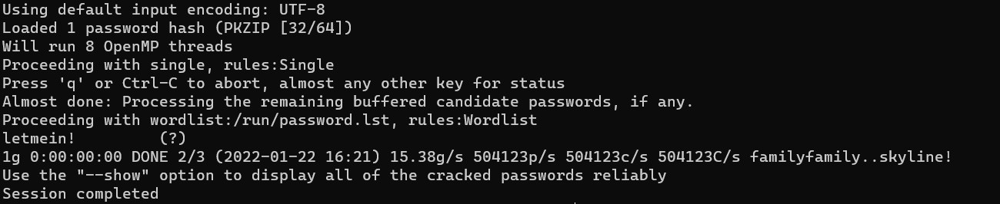

- Used this password and opened the _flag.txt_

> Flag: KCTF{BiNw4lk_is_h3lpfUl}
